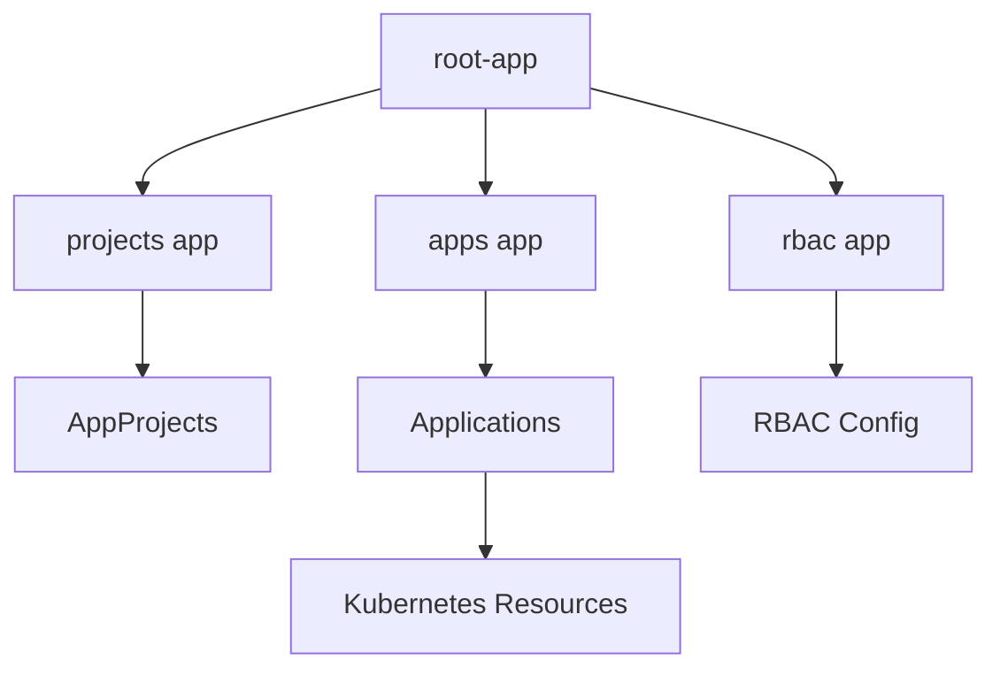
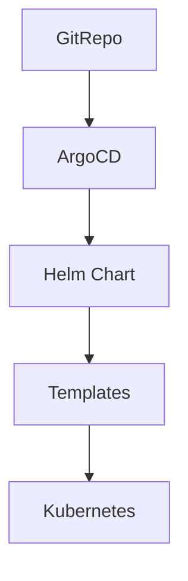

# gitops-cluster-bootstrap

# gitops-cluster-bootstrap

This repository is the **GitOps root repository** used to manage a Kubernetes cluster using **ArgoCD.**

It follows a declarative approach where all infrastructure and applications are defined in Git and automatically reconciled with the cluster.

---

## 🧠 Architecture Overview

This project follows a **layered App of Apps pattern**:


---
## 🎯 Entry Point

The only entry point to the system is:

👉 root-app

All other applications (apps, projects, rbac) are managed declaratively by this root application.

---

## 🧩 Layered App of Apps Pattern

This repository uses a layered architecture:

- root-app → orchestrates everything
- projects → manages AppProjects (governance)
- apps → manages business applications
- rbac → manages access control

This separation improves:

- Scalability
- Security
- Maintainability

---

## 🚀 Core Concepts
### 1. App of Apps (Orchestration)

A root ArgoCD application (root-app) manages a set of layered applications (apps, projects, rbac), which in turn manage cluster resources.

- Central entrypoint
- Enables full GitOps automation
- Simplifies onboarding of new applications

---
### 2. AppProjects (Governance)

AppProjects define security and governance boundaries:

- Allowed repositories
- Allowed namespaces
- Resource restrictions

Each application must belong to a project.

---

### 3. RBAC (Access Control)

RBAC is managed via argocd-rbac-cm:

- Defines roles
- Assigns permissions
- Restricts access per application/project

---

### 4. GitOps Workflow

````mermaid
sequenceDiagram
  participant Dev as Developer
  participant Git as Git Repository
  participant ArgoCD
  participant K8s as Kubernetes

  Dev->>Git: Push manifests
  ArgoCD->>Git: Detect changes
  ArgoCD->>K8s: Apply desired state
  K8s-->>ArgoCD: Cluster state
  
````

---

## 🌍 External Access (Cloudflare)
ArgoCD is exposed securely using **Cloudflare Tunnel.**

````mermaid
graph LR
    User --> Cloudflare
    Cloudflare --> Tunnel[Cloudflare Tunnel]
    Tunnel --> ArgoCD
    ArgoCD --> Kubernetes
````
### Benefits

- No public LoadBalancer required
- Secure HTTPS access
- Zero Trust compatible
- Protection via Cloudflare (WAF)

---

## 📁 Repository Structure
````shell
.
├── argocd/          # Bootstrap layer (root-app + system apps)
│   ├── root-app.yaml
│   ├── apps.yaml
│   ├── projects.yaml
│   └── rbac.yaml
├── apps/            # Business applications
│   └── guestbook/
├── projects/        # AppProjects (governance)
├── rbac/            # RBAC configuration
└── docs/            # Application-specific documentation
````
---

## 📚 Documentation

Each application has its own documentation inside /docs.

👉 Example:

docs/guestbook.md

---

## ✅ Best Practices

- Git is the single source of truth
- Enable auto-sync:
    - prune: true
    - selfHeal: true
- Use AppProjects for isolation
- Avoid manual changes in cluster
- Use RBAC to restrict access per team

---

## 📦 Future: Helm-based Deployments
This section describes the future evolution of the platform toward **Helm-based deployments.**

This repository will evolve to support **Helm-based application deployments**.

### Why Helm?

- Standardized packaging
- Reusable templates
- Environment-specific configuration
- Better scalability for multiple applications

---

### Planned Architecture


---
### Strategy

Applications will progressively be defined using Helm charts.

Example structure:

````shell
apps/
 ├── my-app/
 │   ├── Chart.yaml
 │   ├── values.yaml
 │   ├── values-dev.yaml
 │   └── templates/
````
---

### ArgoCD Integration

ArgoCD natively supports Helm charts, allowing seamless integration with GitOps workflows.

Example:

```yaml
spec:
  source:
    repoURL: <repo>
    path: apps/my-app
    helm:
      valueFiles:
        - values.yaml
```

---

## Roadmap

- Add OIDC (Keycloak) integration
- Multi-environment setup (dev/staging/prod)
- Observability (Prometheus/Grafana)
- ArgoCD Notifications
- Multi-cluster support
