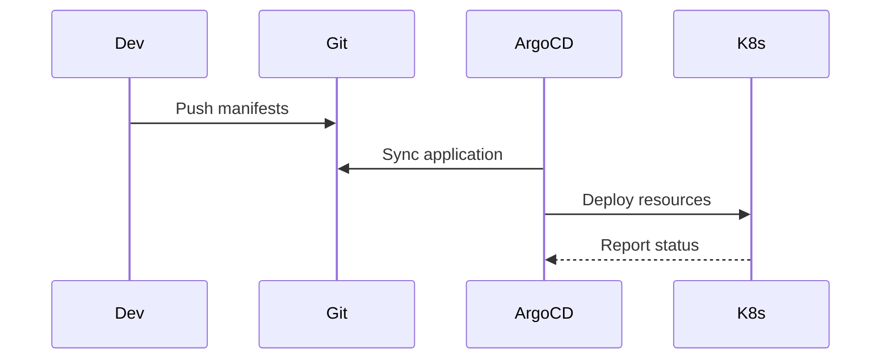

# Guestbook Application

This document describes the deployment of a **test application** used to validate the GitOps workflow.

⚠️ This application is for demonstration purposes only.

---

## 🧠 Overview

The guestbook application is deployed using:

* ArgoCD Application
* AppProject (governance)
* ArgoCD RBAC (access control)

---

## 🔄 GitOps Flow



---

## 📦 Namespace

The application is deployed in the `guestbook` namespace.

---

## 🚀 ArgoCD Application

The application is managed by the root app using the App of Apps pattern.

```yaml
apiVersion: argoproj.io/v1alpha1
kind: Application
metadata:
  name: guestbook
  namespace: argocd
spec:
  project: guestbook-project

  source:
    repoURL: <your-repo>
    targetRevision: HEAD
    path: apps/guestbook

  destination:
    server: https://kubernetes.default.svc
    namespace: guestbook

  syncPolicy:
    automated:
      prune: true
      selfHeal: true
```

---

## 🛡️ AppProject

The project restricts the application scope.

```yaml
apiVersion: argoproj.io/v1alpha1
kind: AppProject
metadata:
  name: guestbook-project
  namespace: argocd
spec:
  destinations:
    - namespace: guestbook
      server: https://kubernetes.default.svc

  sourceRepos:
    - '*'
```

---

## 🔐 ArgoCD RBAC

### Create user

```yaml
data:
  accounts.guestbook-dev: login
  accounts.guestbook-dev.enabled: "true"
```

---

### Role definition

```yaml
p, role:dev-guestbook, applications, get, guestbook-project/guestbook, allow
p, role:dev-guestbook, applications, sync, guestbook-project/guestbook, allow
```

---

### Bind user

```yaml
g, guestbook-dev, role:dev-guestbook
```

---

## 🔧 Operations

### Restart ArgoCD

```bash
kubectl -n argocd rollout restart deployment argocd-server
```

---

### List users

```bash
argocd account list
```

---

### Set password

```bash
argocd account update-password --account guestbook-dev
```

---

## 🧪 Validation

After deployment:

* Application should be **Healthy**
* Sync status should be **Synced**
* Pods should be running

---

## 📦 Future Improvement: Helm Migration

The guestbook application is currently deployed using raw Kubernetes manifests.

It will later be migrated to Helm to:

* simplify configuration
* support multiple environments
* improve reusability

---

## 📌 Notes

* This app is a **reference implementation**
* Can be removed or replaced by real workloads
* Useful for testing RBAC and AppProject behavior
